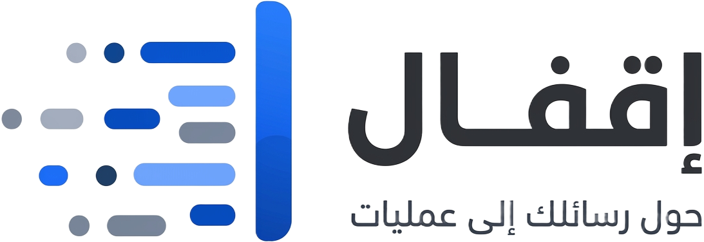

# منظومة إقفال | Eqfal System

<div align="center">
  
  <h3>المنظومة الأولى لتحويل رسائل واتساب إلى قيود وسندات محاسبية ذكية</h3>
  <p><b>Enterprise-Grade Financial Operations & WhatsApp Automation Platform</b></p>

  [](https://dotnet.microsoft.com/)
  [](https://flutter.dev/)
  [](https://angular.io/)
  [](https://www.microsoft.com/sql-server)
  [](https://openai.com/)
  [](#)
</div>

---

## 📌 نبذة عن المشروع (Project Overview)

منظومة **إقفال (Eqfal)** هي منصة مالية ومحاسبية متكاملة (Enterprise Full-Stack System) صُممت لأتمتة العمليات المالية لشركات الصرافة، التجارة، والمكاتب التي تعتمد على تطبيقات المراسلة (واتساب) في تداول الأموال والمعاملات اليومية.

يقوم النظام بالتقاط الرسائل المالية، تحليلها فورياً بالذكاء الاصطناعي، تحويلها إلى قيود محاسبية مزدوجة (Double-entry Bookkeeping)، وتوليد سندات قبض وصرف رسمية مع تتبع كامل لأي تعديل أو حذف يطرأ على الرسائل لضمان حفظ الحقوق المالية.

---

## 🏛️ هيكلية النظام والمشاريع (System Architecture)

تم بناء النظام وفق نمط الـ **Clean Architecture** والـ **Microservices** بتوزيع متناسق للمسؤوليات:

```text
Eqfal_System/
│
├── 📂 Eqfal.API/               # الباك إند: ASP.NET Core 8 Web API
│   ├── Controllers/            # نقاط نهاية الـ RESTful API
│   ├── Data/ & Models/         # Entity Framework Core & Domain Entities
│   ├── Services/               # منطق الأعمال، الذكاء الاصطناعي، والـ Webhooks
│   └── appsettings.Example.json# قالب الإعدادات الآمن
│
├── 📂 Eqfal.App/               # تطبيق الموبايل: Flutter (Android & iOS)
│   ├── lib/screens/            # واجهات التطبيق المتجاوبة
│   ├── lib/providers/          # إدارة الحالة (State Management)
│   └── lib/services/           # خدمات الاتصال بالـ API والمزامنة
│
├── 📂 Eqfal.Company/           # لوحة التحكم المؤسسية: Angular Web Portal
│   ├── src/app/                # مكونات إدارة الحسابات، التقارير، والاشتراكات
│   └── package.json            # تبعيات الـ Frontend
│
├── 📂 Eqfal.LandingPage/       # الموقع التعريفي والتسويقي التفاعلي
│   ├── index.html              # صفحة هبوط حديثة وسريعة ومتجاوبة 100%
│   ├── style.css               # Vanilla CSS Design System (Light/Dark Mode)
│   └── script.js               # تفاعل الكروت ثلاثية الأبعاد والمحاكاة
│
└── 📂 Eqfal.WhatsAppService/   # ميكروسيرفيس الربط مع واتساب (Node.js/Socket)
    ├── index.js                # معالج الأحداث وقراءة الرسائل اللحظية
    └── config.example.json     # قالب الإعدادات الآمن
```

---

## ✨ أبرز المزايا التقنية (Key Technical Highlights)

1. **معالجة اللغة الطبيعية والذكاء الاصطناعي (AI Message Parsing)**:
   - دعم كامل للهجات المحلية والعبارات المحاسبية غير النمطية.
   - استخراج تلقائي للطرف المستفيد، العملة (دينار، دولار، يورو)، المبلغ، ونوع العملية (تسليم / استلام).

2. **قيد محاسبي مزدوج مؤتمت (Automated Double-Entry Accounting)**:
   - إنشاء قيود اليومية، سندات القبض، وسندات الصرف في قاعدة البيانات لحظياً بدون تدخل بشري.

3. **سجل التدقيق الرقابي ضد التلاعب (Audit Log & Anti-Tamper)**:
   - رصد وتوثيق أي تعديل أو حذف لرسائل الواتساب مع حفظ النص الأصلي والتاريخ والوقت لحماية حقوق التجار.

4. **نظام استكمال البيانات الناقصة (Needs Completion Workflow)**:
   - فرز تلقائي للرسائل المبهمة أو التي تنقصها بيانات (مثل مبالغ غير محددة) لتوجيه المحاسب لاستكمالها.

5. **المزامنة اللحظية وتنبيهات الدفع (Real-Time Sync & Payments)**:
   - تكامل مع بوابات الدفع الإلكتروني (EzonePay) وإشعارات فورية عبر الـ Push Notifications.

6. **إقفال الحسابات وتقارير PDF / Excel**:
   - توليد كشوفات حساب تفصيلية وسندات رسمية قابلة للطباعة والتصدير.

---

## 🛠️ حزمة التقنيات المستخدمة (Tech Stack)

- **Backend**: C# 12, ASP.NET Core 8 Web API, Entity Framework Core, SQL Server.
- **Mobile Client**: Flutter, Dart, Provider Architecture, REST APIs.
- **Web Dashboard**: Angular 17+, TypeScript, SCSS, RxJS.
- **WhatsApp Integration**: Node.js, Baileys WebSocket Engine.
- **AI & LLM Services**: OpenAI API, Google Gemini Flash API.
- **Security & Auth**: JWT (JSON Web Tokens), Role-Based Access Control (RBAC), Data Sanitization.
- **DevOps & Standards**: Clean Architecture, Repository Pattern, GitFlow.

---

## 🚀 التشغيل والإعداد المحلي (Getting Started)

### 1. إعداد الباك إند (Backend Setup)
1. انتقل إلى مجلد `Eqfal.API`:
   ```bash
   cd Eqfal.API
   ```
2. أنشئ ملف `appsettings.json` من القالب الآمن:
   ```bash
   cp appsettings.Example.json appsettings.json
   ```
3. عدّل بيانات الاتصال بقاعدة بياناتك في `DefaultConnection`.
4. شغّل المشروع عبر الـ CLI:
   ```bash
   dotnet restore
   dotnet run
   ```

### 2. إعداد تطبيق الموبايل (Flutter App Setup)
1. انتقل إلى مجلد `Eqfal.App`:
   ```bash
   cd Eqfal.App
   ```
2. قم بتحميل التبعيات وتشغيل التطبيق:
   ```bash
   flutter pub get
   flutter run
   ```

### 3. إعداد لوحة التحكم (Angular Dashboard)
```bash
cd Eqfal.Company
npm install
npm start
```

---

## 🔒 الأمان وحماية البيانات (Security & Privacy)

- تم استبعاد كافة بيانات الاتصال، كلمات المرور، المفاتيح السرية، وجلسات واتساب من التتبع العام عبر سياسات `.gitignore` الصارمة.
- يُرجى استخدام ملفات `*.Example.json` كمرجع لتهيئة البيئات المحلية والإنتاجية.

---

## 👨‍💻 المطور (Author & Contact)

- **الاسم**: Mohamed Suliman
- **GitHub**: [@mohamed-suliman2004](https://github.com/mohamed-suliman2004)
- **المشروع**: منظومة إقفال (Eqfal Financial Accounting System)
- **الشركة المطورة**: شركة المستند للحلول التقنية والذكاء الاصطناعي (Mostanad Tech)
